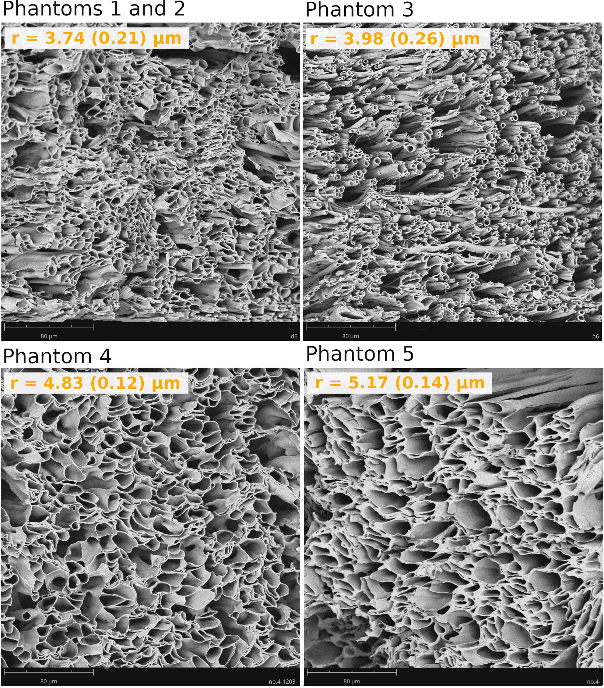
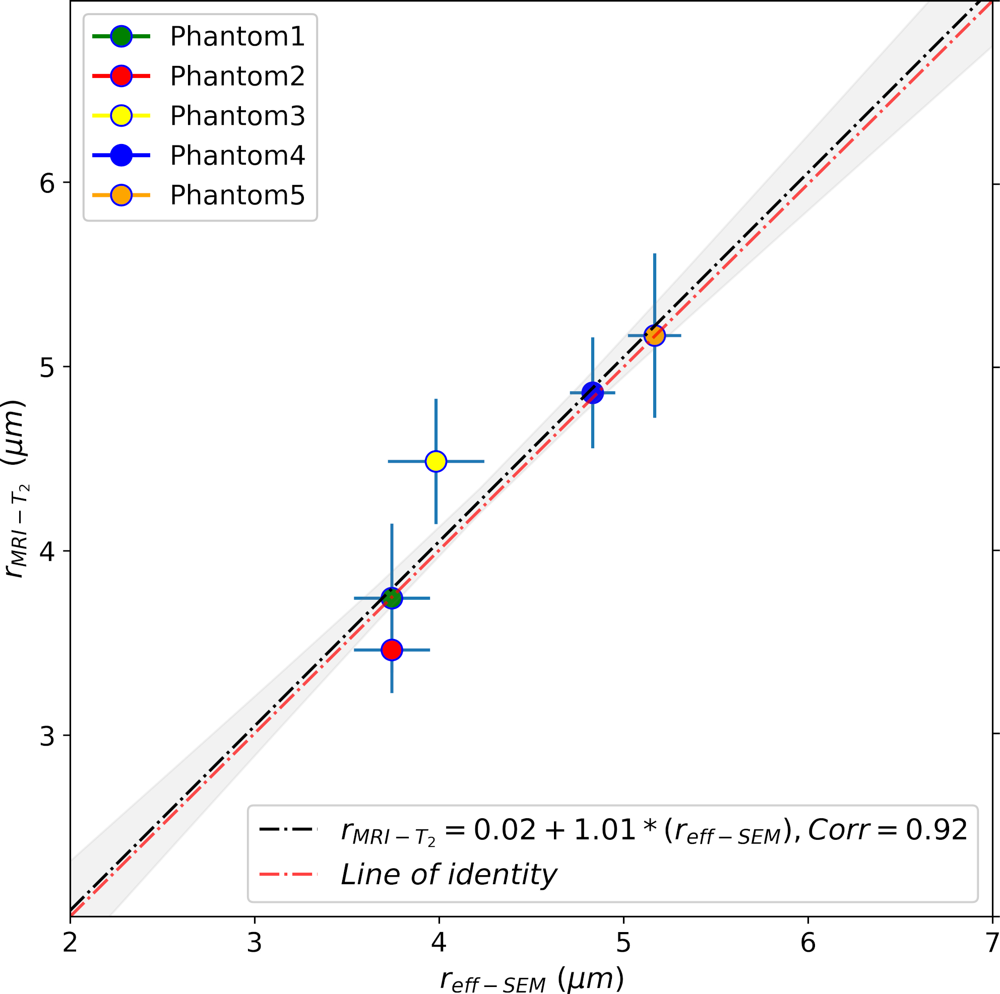

## diffusion-relaxation MRI data from biomimetic phantoms
We provide diffusion-relaxation MRI data and methods for estimating the inner fibre radius of biomimetic phantoms, which will be freely available after the article's acceptance 🎁.

Scanning Electron Micrographs depicting the microscopic morphology of the biomimetic phantoms. All phantom samples are shown using the same length scale. The mean effective (i.e., area-weighted) radius and the standard deviation (std) of each phantom are indicated in each panel, i.e., r = mean (std). Phantom1 and Phantom2 are displayed together as both were built using similar distributions of inner fibre radii.

## **Implementation of the algorithms described here:** 📢

> **Using diffusion-relaxation MRI to estimate the inner radius of axon-mimicking microfibre phantoms**. 
Erick J. Canales-Rodríguez, Marco Pizzolato, Feng-Lei Zhou, Muhamed Barakovic, Jean-Philippe Thiran, Derek K. Jones, Geoffrey J.M. Parker, Tim B. Dyrby (under review, 2022).

Linear relationship between the T2-based inner fibre radius (y-axis, rMRI-T2) and the effective radius measured from Scanning Electron Microscope images (x-axis, reff-SEM). The scatter plot depicts the mean values for all the voxels inside the phantoms and their corresponding errors (i.e., standard deviation) on each axis. The ‘line of identity’ (representing the perfect linear agreement between both estimates, in red) is inside the 95% confidence bands (in grey).
